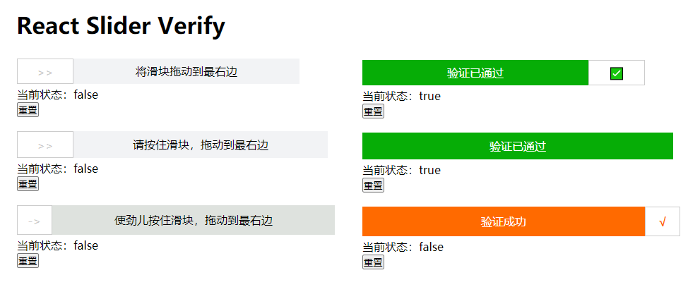

# react-slider-verify

## React 滑动验证组件

[在线示例](./example/index.tsx)：[https://shenbao.github.io/react-slider-verify/dist/index.html](https://shenbao.github.io/react-slider-verify/dist/index.html)

## 截图



## 安装

```bash
$ npm install react-slider-verify -S
```

## 使用组件

```js
<ReactSliderVerify onSuccess={() => {}} />
```

## 重置状态方法

```js
const ref = useRef({} as any);

<div>
    <ReactSliderVerify
    ref={ref}
    tips={"将滑块拖动到最右边"}
    onSuccess={() => setState(true)}
    />
    <div>当前状态：{`${state}`}</div>
    <button
        onClick={() => {
            ref.current.reset();
            setState(false);
        }}
    >
    重置
    </button>
</div>

```

## 参数说明

| 字段名     | 字段类型    | 默认值                   | 说明             |
| ---------- | ----------- | ------------------------ | ---------------- |
| width      | number      | 400                      | 长度             |
| height     | number      | 36                       | 宽度             |
| bgColor    | string      | #F2F3F5                  | 背景颜色         |
| tips       | ReactComponentLike      | 请按住滑块，拖动到最右边 | 提示文案         |
| barWidth   | number      | 80                       | 滑块宽度         |
| bar        | ReactComponentLike | `>>` | 滑块的内容       |
| successBar | ReactComponentLike | ✅                       | 成功后滑块的内容 |
| successBgColor | string | #06ad06 | 成功后背景颜色 |
| successTips | ReactComponentLike | 验证已通过 | 成功文案 |
| successShowBar | bool | true | 成功后的是否显示 Bar |

## 事件

| 事件名    | 说明                 | 回调参数 |
| --------- | -------------------- | -------- |
| onSuccess | 验证完成后的回调函数 | -        |

## 方法

| 事件名 | 说明                   | 参数 |
| ------ | ---------------------- | ---- |
| reset  | 使验证器重置为初始状态 | -    |

## More links

- [GitHub Home](https://github.com/ShenBao)
- [Blog Home](https://shenbao.github.io)
- [About Me](https://shenbao.github.io/about/)
